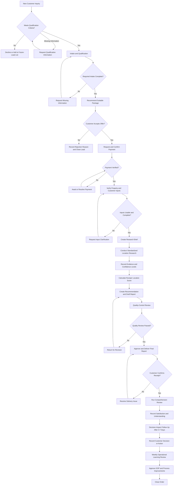

# SOP-OPS-001: Customer Order to Decision-Impact Follow-Up

## Document Control

| Item | Definition |
|---|---|
| SOP ID | SOP-OPS-001 |
| Process owner | Operations Lead |
| Applies to | Rumper concierge location-risk audit orders |
| Effective stage | Pre-launch validation and concierge MVP |
| Review frequency | Weekly during validation; quarterly after formal launch |
| Primary service area | Jabodetabek |
| Related packages | Single-Location Audit, Dual-Location Comparison, consultation add-on |
| Research workflow | `SOP-RSCH-001` |
| Scoring standard | `STD-SCR-001` |

## 1. Purpose

This SOP defines the controlled workflow for converting a qualified customer inquiry into a delivered Rumper Location Risk Audit, measuring its effect on the customer's decision, and improving the operating process.

The SOP ensures that:

- Rumper accepts orders only from customers within the current service scope.
- Research begins only after payment and required inputs are verified.
- Every material finding is supported by recorded evidence and a confidence label.
- No report is delivered before quality-control approval.
- Customer understanding, satisfaction, and decision impact are measured consistently.
- Operational learning results in controlled changes to the process.

## 2. Scope

### Included

- First-time homebuyers purchasing a home for personal occupancy
- Shortlisted properties in Jabodetabek
- Buyers expecting to decide within three months
- Single-location and dual-location audits
- Intake, payment confirmation, research, scoring, quality control, delivery, feedback, and follow-up

### Excluded

- Buyers without a specific property candidate
- Investment-only purchases
- Locations outside the current service area
- Building-condition inspections
- Legal due diligence, developer ratings, KPR simulations, or investment-return forecasts
- Self-service or automatically generated reports

## 3. Roles and Responsibilities

During early validation, one person may perform multiple roles. Quality review should be completed by a second person whenever possible.

| Role | Accountable responsibilities |
|---|---|
| Customer Service | Customer communication, intake coordination, payment follow-up, delivery confirmation |
| Operations Lead | Qualification decisions, package approval, workflow oversight, exceptions, operational review |
| Research Analyst | Input verification, evidence collection, scoring, recommendation, draft report |
| Quality Reviewer | Independent review of evidence, scores, claims, privacy, and package completeness |
| Customer Research Lead | Comprehension review, satisfaction measurement, decision-impact follow-up |

### RACI Matrix

| Stage | Customer Service | Operations Lead | Research Analyst | Quality Reviewer | Customer Research Lead |
|---|---|---|---|---|---|
| Qualified inquiry | R | A | I | I | C |
| Intake and qualification | R | A | C | I | C |
| Package recommendation | R | A | C | I | I |
| Payment confirmation | R | A | I | I | I |
| Input verification | C | A | R | I | I |
| Location research | I | A | R | C | I |
| Scoring and recommendation | I | A | R | C | I |
| Quality-control review | I | A | C | R | I |
| Report delivery | R | A | C | I | I |
| Comprehension review | C | A | I | I | R |
| Decision-impact follow-up | C | A | I | I | R |
| Operational learning review | C | A/R | C | C | C |

`R` = Responsible, `A` = Accountable, `C` = Consulted, `I` = Informed.

## 4. Operating Principles

1. An order may move forward only when the current stage's completion criteria have passed.
2. Research must not begin before payment and required inputs are verified.
3. Facts, analyst interpretations, recommendations, and evidence gaps must remain distinguishable.
4. Missing or conflicting evidence must be disclosed rather than guessed or silently resolved.
5. A score is decision support, not a guarantee that a location is safe or suitable.
6. Real customer data, locations, payment records, and reports must not be committed to Git.
7. Every status change, exception, revision, and customer decision action must be recorded.

## 5. Workflow



## 6. Workflow Statuses

Use the following statuses in the order tracker:

| Status | Meaning |
|---|---|
| `new_inquiry` | Inquiry received but not assessed |
| `awaiting_intake` | Qualification appears possible; required intake is incomplete |
| `qualified` | Customer and property meet current eligibility criteria |
| `awaiting_payment` | Package accepted; payment not yet verified |
| `awaiting_information` | Required customer or property input is missing or unusable |
| `ready_for_research` | Payment and required inputs are verified |
| `research_in_progress` | Standardized evidence collection is underway |
| `scoring_in_progress` | Research is complete; scoring and recommendation are underway |
| `quality_review` | Draft report is awaiting quality-control approval |
| `revision_required` | Quality review identified issues that must be resolved |
| `ready_for_delivery` | Report passed quality control |
| `delivered` | Customer received and can open the report |
| `feedback_completed` | Comprehension and satisfaction review completed |
| `follow_up_completed` | Decision-impact follow-up completed |
| `closed` | All required stages and records are complete |
| `cancelled` | Order stopped before completion with reason recorded |

### Allowed Status Transitions

| Current status | Allowed next status |
|---|---|
| `new_inquiry` | `awaiting_intake`, `qualified`, `cancelled` |
| `awaiting_intake` | `qualified`, `cancelled` |
| `qualified` | `awaiting_payment`, `cancelled` |
| `awaiting_payment` | `awaiting_information`, `ready_for_research`, `cancelled` |
| `awaiting_information` | Return to the status that required the missing information, or `cancelled` |
| `ready_for_research` | `research_in_progress`, `cancelled` |
| `research_in_progress` | `awaiting_information`, `scoring_in_progress`, `cancelled` |
| `scoring_in_progress` | `quality_review`, `awaiting_information` |
| `quality_review` | `revision_required`, `ready_for_delivery` |
| `revision_required` | `quality_review` |
| `ready_for_delivery` | `delivered` |
| `delivered` | `feedback_completed` |
| `feedback_completed` | `follow_up_completed` |
| `follow_up_completed` | `closed` |

Skipping a status requires Operations Lead approval and a documented reason.

## 7. Stage Procedures

### 7.1 Qualified Inquiry

**Trigger:** A prospective customer contacts Rumper or submits an inquiry.

**Owner:** Operations Lead  
**Responsible:** Customer Service  
**Target SLA:** Initial assessment within 4 business hours.

**Required qualification criteria:**

- First-time homebuyer purchasing for personal occupancy
- Has a usable property address, listing link, development name, or map pin
- Property is within Jabodetabek
- Expects to decide within three months
- Has a specific concern such as flood, commute, access, or environmental risk

**Procedure:**

1. Create a lead record and assign a unique Lead ID.
2. Record lead source, contact channel, property availability, decision timeline, and stated concern.
3. Assess the lead against the qualification criteria.
4. Set the result to `qualified`, `awaiting_intake`, or `cancelled`.
5. For declined inquiries, record the reason and provide a clear response.

**Completion criteria:** Qualification decision and reason are recorded.

**Output:** Qualified lead record or documented decline.

### 7.2 Intake and Qualification

**Trigger:** Lead passes the initial qualification assessment.

**Owner:** Operations Lead  
**Responsible:** Customer Service  
**Target SLA:** Complete within 1 business day.

**Required inputs:**

- Customer contact and consent
- Property location or locations
- Purchase purpose
- Booking fee or DP decision timeline
- Primary concerns
- Important daily destinations
- Preferred transport method
- Other properties being considered

**Procedure:**

1. Send the approved intake form or collect the information through the approved channel.
2. Review all required fields.
3. Conduct a short qualification conversation when urgency, intended use, or concerns remain unclear.
4. Record all missing information and request it from the customer.
5. Confirm whether the order remains within scope.

**Completion criteria:** All required intake fields are complete and eligibility is confirmed.

**Output:** Approved intake record.

### 7.3 Package Recommendation

**Trigger:** Intake and qualification are complete.

**Owner:** Operations Lead  
**Responsible:** Customer Service  
**Target SLA:** Recommendation within 4 business hours.

**Decision rules:**

| Customer need | Recommended package |
|---|---|
| Evaluate one property | Single-Location Audit |
| Compare two properties | Dual-Location Comparison |
| Needs a detailed verbal explanation | Add consultation |
| Has no usable property candidate | Decline or return to intake |

**Procedure:**

1. Match the customer need to the smallest suitable package.
2. Confirm scope, price, expected delivery time, limitations, and revision policy.
3. Record the package offered and reason for recommendation.
4. If declined, record the customer's reason verbatim and close or retain the lead as appropriate.

**Completion criteria:** Customer accepts or declines a clearly documented offer.

**Output:** Accepted quotation or recorded rejection.

### 7.4 Payment Confirmation

**Trigger:** Customer accepts the package.

**Owner:** Operations Lead  
**Responsible:** Customer Service  
**Target SLA:** Verify within 4 business hours after receiving payment evidence.

**Procedure:**

1. Assign an internal Order ID.
2. Send payment instructions and applicable terms.
3. Verify the amount, package, payment date, and payment evidence.
4. Record the delivery deadline.
5. Set status to `awaiting_payment` until verification succeeds.
6. Request clarification while keeping status `awaiting_payment` if payment evidence cannot be verified.

**Completion criteria:** Payment is verified and recorded.

**Output:** Confirmed active order.

### 7.5 Input Verification

**Trigger:** Payment is confirmed.

**Owner:** Operations Lead  
**Responsible:** Research Analyst  
**Target SLA:** Complete within 4 business hours.

**Procedure:**

1. Confirm the map pin matches the intended property.
2. Confirm the property name, address, and listing information are consistent.
3. Confirm commute destinations and transport preferences are usable.
4. Translate customer concerns into specific research questions.
5. Request clarification for any critical ambiguity.
6. Create a research brief defining the property, customer context, priority questions, package scope, and deadline.
7. Set status to `ready_for_research` after all critical inputs pass verification.

**Completion criteria:** All critical inputs are usable and the research brief is complete.

**Output:** Verified research brief and status `ready_for_research`.

### 7.6 Standardized Location Research

**Trigger:** Order status is `ready_for_research`.

**Owner:** Operations Lead  
**Responsible:** Research Analyst  
**Target SLA:** Complete within 1 business day and within the promised delivery deadline.

**Required research dimensions:**

1. Flood resilience
2. Commute efficiency
3. Physical access and roads
4. Essential amenities
5. Environmental quality and red flags

**Required record for every material finding:**

- Claim or observation
- Source and URL or source reference
- Source publication or observation date, where available
- Research access date
- Supporting evidence
- Coverage area or relevance to the candidate location
- Confidence level: `High`, `Medium`, or `Low`
- Analyst notes and known limitations

**Procedure:**

1. Research every required dimension using the approved checklist and source registry.
2. Set status to `research_in_progress`.
3. Prioritize the questions identified in the research brief.
4. Record all material evidence and source details.
5. Record conflicting sources without silently choosing one.
6. Mark unavailable or weak evidence as an evidence gap.
7. Stop and escalate if the location cannot be reliably identified or a critical source-quality issue prevents responsible analysis.
8. Set status to `scoring_in_progress` after completing or explicitly marking every required dimension.

**Completion criteria:** Every required dimension is complete or explicitly marked as an evidence gap.

**Output:** Completed research evidence worksheet.

### 7.7 Scoring and Recommendation

**Trigger:** Standardized research is complete.

**Owner:** Operations Lead  
**Responsible:** Research Analyst  
**Target SLA:** Complete within 2 hands-on hours.

**Procedure:**

1. Assign a 0-100 dimension score using `STD-SCR-001`.
2. Calculate the Rumper Location Score:

```text
RLS = (Flood x 0.30) + (Commute x 0.25) + (Physical Access x 0.15)
    + (Amenities x 0.15) + (Environmental Quality x 0.15)
```

3. Apply the confidence and critical red-flag rules in `STD-SCR-001`.
4. Keep evidence, dimension scores, and buyer recommendation as separate analytical layers.
5. Select one primary recommendation:
   - `Proceed`
   - `Proceed with caution`
   - `Verify further before deciding`
   - `Avoid until major concerns are resolved`
6. Explain why the recommendation follows from the evidence and customer context.
7. Create a tailored physical-survey and next-action checklist.
8. Assemble the draft report for the purchased package.
9. Set status to `quality_review` when the draft report and supporting records are complete.

**Completion criteria:** Scores are supported by recorded evidence, calculations are correct, and one clear recommendation is documented.

**Output:** Draft report, score worksheet, and recommendation.

### 7.8 Quality-Control Review

**Trigger:** Draft report and score worksheet are complete.

**Owner:** Operations Lead  
**Responsible:** Quality Reviewer  
**Target SLA:** Complete within 2 business hours.

**Review requirements:**

- Required research dimensions are complete.
- Every major claim has evidence.
- Sources and relevant dates are recorded.
- Confidence labels are justified.
- Scores match the evidence and calculation.
- Facts, interpretations, and recommendations are distinguishable.
- Recommendation is clear and does not imply a guarantee.
- Limitations and evidence gaps are disclosed.
- Package requirements are complete.
- Customer and property data are handled correctly.
- Filename, Order ID, report version, and delivery details are correct.

**Procedure:**

1. Review the report and supporting records against the checklist.
2. Classify issues as critical or non-critical.
3. Set status to `revision_required` when any critical issue exists.
4. Return specific revision notes to the Research Analyst.
5. Re-review corrected items.
6. Approve the report only when all critical checks pass.

**Completion criteria:** All critical checks pass and approval is recorded.

**Output:** Approved final report and status `ready_for_delivery`.

### 7.9 Report Delivery

**Trigger:** Quality-control approval is recorded.

**Owner:** Operations Lead  
**Responsible:** Customer Service  
**Target SLA:** Deliver within the promised customer deadline.

**Procedure:**

1. Send the approved final PDF through the agreed channel.
2. Include a short summary of the primary recommendation and important next action.
3. State the report's limitations and invite clarification questions.
4. Record the report version, delivery time, and delivery channel.
5. Confirm the customer can receive and open the report.
6. Resolve delivery issues and repeat confirmation when necessary.

**Completion criteria:** Customer confirms successful receipt and access.

**Output:** Delivery record and status `delivered`.

### 7.10 Comprehension Review

**Trigger:** Customer confirms report receipt.

**Owner:** Operations Lead  
**Responsible:** Customer Research Lead  
**Target SLA:** Complete within 2 days after delivery.

**Procedure:**

1. Ask the customer to read the report independently before providing an explanation.
2. Ask the customer to identify:
   - The most important risk
   - The confidence or reliability of the evidence
   - Rumper's primary recommendation
   - The next action or physical-survey verification required
   - How they would explain the result to their spouse or family
3. Record pass or fail for each comprehension task.
4. Collect a 1-10 satisfaction rating and qualitative feedback.
5. Record unclear, untrusted, or low-value report sections.
6. Provide clarification after the independent comprehension check is complete.

**Completion criteria:** Comprehension results, satisfaction, and feedback are recorded.

**Output:** Feedback record and status `feedback_completed`.

### 7.11 Decision-Impact Follow-Up

**Trigger:** Report has been delivered and at least 3 days have passed.

**Owner:** Operations Lead  
**Responsible:** Customer Research Lead  
**Target SLA:** Complete 3-7 days after delivery.

**Procedure:**

1. Ask what decision or verification action the customer took after receiving the report.
2. Record one or more outcomes:
   - Proceeded with purchase
   - Paused or delayed the decision
   - Cancelled or stopped the purchase
   - Conducted another physical survey
   - Verified findings with local sources
   - Negotiated with the seller
   - Compared another property
   - Took no action
3. Record which finding or recommendation influenced the outcome.
4. Request testimonial or case-study permission separately and record consent.

**Completion criteria:** A concrete action or explicit no-action outcome is recorded.

**Output:** Decision-impact record and status `follow_up_completed`.

### 7.12 Operational Learning Review

**Trigger:** Weekly review date or completion of a significant report batch.

**Owner and Responsible:** Operations Lead  
**Target SLA:** Complete weekly during validation.

**Required review metrics:**

- New inquiries, qualified leads, accepted offers, and paid orders
- Qualification-to-payment conversion
- Average order value
- Production time by workflow stage
- On-time delivery rate
- Quality-control failure and revision rate
- Customer comprehension pass rate
- Satisfaction above 8/10
- Concrete decision-impact actions
- Recurring evidence gaps, objections, and customer questions

**Procedure:**

1. Review completed orders and operational metrics.
2. Identify recurring failures, delays, evidence gaps, and customer misunderstandings.
3. Separate isolated cases from repeatable process problems.
4. Define each approved improvement with an owner, due date, and expected result.
5. Update affected SOPs, templates, checklists, or scoring guidance.
6. Record the change and effective date.
7. Close orders only after required records are complete.

**Completion criteria:** Metrics are reviewed and approved actions are recorded.

**Output:** Operational improvement log, controlled SOP changes, and status `closed`.

## 8. Exception and Escalation Rules

| Exception | Required action | Escalation owner |
|---|---|---|
| Customer is outside current scope | Decline or record for future service; do not force-fit the order | Operations Lead |
| Payment cannot be verified | Keep order in `awaiting_payment`; do not start research | Operations Lead |
| Property location is ambiguous | Set `awaiting_information` and request clarification | Research Analyst |
| Critical evidence is missing or conflicting | Disclose the gap, lower confidence, and escalate before scoring | Operations Lead |
| Delivery deadline is at risk | Inform the customer before the deadline and agree on the next action | Operations Lead |
| Critical quality failure is found | Set `revision_required`; delivery is prohibited | Quality Reviewer |
| Incorrect report was delivered | Notify Operations Lead immediately, contain access where possible, correct, and document incident | Operations Lead |
| Customer disputes a finding | Review evidence and explanation; issue a controlled correction when justified | Operations Lead |
| Personal data may be exposed | Stop processing, contain the issue, and record the incident | Operations Lead |

## 9. Required Records

Each completed order must maintain a complete evidence chain:

| Record | Required contents |
|---|---|
| Lead and qualification record | Lead ID, source, segment, property availability, concern, timeline, result |
| Intake record | Required customer and property context, consent |
| Offer and payment record | Package, offered price, accepted price, payment status, deadline |
| Research brief | Verified inputs, priority questions, scope, assigned analyst |
| Evidence worksheet | Findings, sources, dates, confidence, notes, evidence gaps |
| Score worksheet | Dimension scores, formula result, rationale |
| Quality-control record | Checklist result, issues, revisions, approval |
| Delivery record | Report version, date, channel, receipt confirmation |
| Feedback record | Comprehension results, satisfaction, qualitative feedback |
| Decision-impact record | Concrete action, influential finding, follow-up date |
| Improvement record | Process issue, approved action, owner, due date, result |

## 10. Service-Level and Quality Targets

| Measure | Target |
|---|---:|
| Initial inquiry assessment | Within 4 business hours |
| Input verification after payment | Within 4 business hours |
| Final report delivery | Within the promised deadline |
| Average hands-on production time | Below 2.5 hours |
| Reports delivered after quality approval | 100% |
| Paid customers rating above 8/10 | At least 80% |
| Comprehension pass rate | At least 80% |
| Completed decision-impact follow-up | 100% of paid customers |

## 11. Data Handling

- Store real customer records, locations, payment evidence, and reports only in approved private storage.
- Do not commit customer data or generated customer reports to Git.
- Use the internal Lead ID and Order ID in operational records whenever possible.
- Share reports only through approved customer channels.
- Record explicit consent before using testimonials or case-study details.
- Use anonymized data for internal examples, training, and repository documentation.

## 12. Definition of Done

An order is complete only when:

- The customer and order were qualified.
- Payment and inputs were verified.
- Required research and scoring records are complete.
- Quality-control approval was recorded.
- The customer received the final report.
- Comprehension, satisfaction, and decision impact were recorded.
- Production time and operational issues were logged.
- The order status is `closed`.
