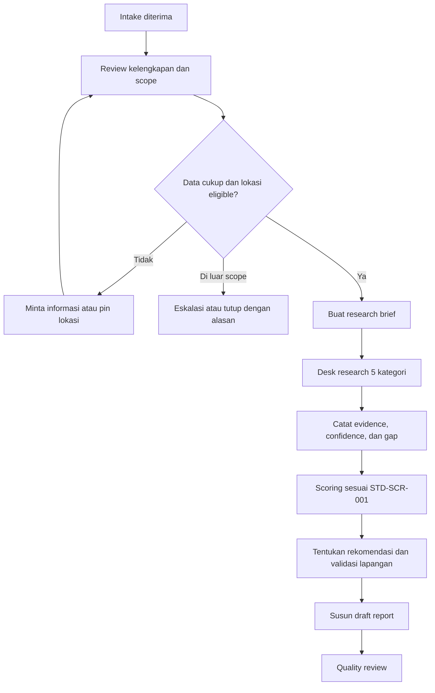

# SOP-RSCH-001: Workflow Internal Setelah Intake

## Kontrol Dokumen

| Item | Definisi |
|---|---|
| SOP ID | SOP-RSCH-001 |
| Process owner | Operations Lead |
| Responsible | Research Analyst |
| Berlaku untuk | Intake yang telah diterima dan siap dinilai |
| Service area MVP | Jabodetabek |
| Scoring standard | `STD-SCR-001` |

## 1. Tujuan

SOP ini mengatur pekerjaan internal sejak data intake diterima sampai draft report siap masuk quality review.

## 2. Workflow

## 3. Step 1 - Intake Review

**Tujuan:** memastikan data cukup, lokasi berada dalam scope, dan pertanyaan riset dapat dibuat.

### Checklist Wajib

- [ ] Alamat, nama perumahan, atau titik lokasi cukup jelas.
- [ ] Link listing dapat dibuka, bila tersedia.
- [ ] Google Maps link atau pin menunjuk kandidat yang dimaksud.
- [ ] Lokasi kerja atau aktivitas utama tersedia untuk analisis commute.
- [ ] Transportasi utama customer diketahui.
- [ ] Tahap keputusan dan timeline customer jelas.
- [ ] Concern utama customer diketahui.
- [ ] Lokasi berada di Jabodetabek.

### Decision Gate

| Kondisi | Tindakan |
|---|---|
| Alamat atau kandidat tidak jelas | Minta user membagikan pin Google Maps |
| Listing tidak dapat dibuka tetapi pin valid | Lanjutkan dan catat listing sebagai evidence gap |
| Lokasi aktivitas utama tidak tersedia | Minta klarifikasi sebelum scoring commute |
| Lokasi di luar Jabodetabek | Eskalasi ke Operations Lead; jangan mulai research standar |
| Tahap keputusan belum jelas | Klarifikasi; tandai sebagai exploratory bila belum memiliki kandidat spesifik |
| Semua input kritis dapat digunakan | Buat research brief dan lanjut ke Step 2 |

**Output:** verified research brief atau request informasi tambahan.

## 4. Step 2 - Location Desk Research

Analyst wajib memeriksa lima kategori. Untuk setiap finding material, catat:

- claim atau observasi;
- sumber dan URL/reference;
- tanggal publikasi/observasi bila tersedia;
- tanggal akses;
- relevansi terhadap titik rumah;
- confidence label;
- keterbatasan dan pertanyaan validasi lapangan.

### A. Ketahanan Banjir

**Periksa:** indikasi area rawan banjir, kedekatan sungai/kali, topografi/kawasan rendah, berita atau riwayat genangan, serta bukti di balik klaim listing seperti `bebas banjir`.

**Output:** tingkat risiko, confidence, alasan, dan hal yang wajib divalidasi ke warga atau saat hujan.

### B. Commute

**Periksa:** jarak dan estimasi waktu ke aktivitas utama, kendaraan pribadi, transportasi umum, bottleneck, jam sibuk, serta biaya dan effort harian secara kualitatif.

**Output:** commute realistis atau berat, estimasi durasi normal dan sibuk, bottleneck, dan pertanyaan apakah toleransi tersebut masuk akal bagi customer.

### C. Akses Fisik dan Jalan

**Periksa:** lebar jalan, akses masuk/keluar, single access point, kondisi jalan utama, kedekatan jalan besar/tol/stasiun, serta bottleneck seperti jembatan, rel, gang sempit, atau putaran jauh.

**Output:** `akses nyaman`, `perlu perhatian`, atau `red flag`, beserta alasan dan validasi lapangan.

### D. Fasilitas Esensial

**Periksa:** minimarket/pasar, klinik/RS/apotek, sekolah/TK bila relevan, transportasi umum, dan fasilitas harian sesuai kebutuhan customer.

**Output:** `cukup`, `terbatas`, atau `tidak sesuai kebutuhan customer`.

### E. Kualitas Lingkungan dan Red Flags

**Periksa:** indikasi industri, TPA, SUTET, rel, kebisingan, polusi, keamanan, dan red flag lokal lain yang relevan.

**Output:** daftar red flag, perkiraan dampak, confidence, dan tindakan validasi.

### Completion Gate

Desk research selesai bila lima kategori telah diperiksa atau secara eksplisit diberi status evidence gap.

## 5. Step 3 - Scoring dan Rekomendasi

1. Beri skor 0-100 pada setiap kategori.
2. Terapkan bobot dan rumus dalam `STD-SCR-001`.
3. Beri confidence label pada setiap kategori.
4. Terapkan red-flag override rule bila diperlukan.
5. Pilih satu rekomendasi utama.
6. Buat checklist validasi lapangan yang spesifik.

**Output:** score worksheet, rekomendasi, dan survey checklist.

## 6. Step 4 - Draft Report dan Handoff

Draft report wajib memuat:

- ringkasan konteks dan kebutuhan customer;
- skor total dan lima skor kategori;
- finding utama, evidence, confidence, dan keterbatasan;
- red flag dan evidence gap;
- rekomendasi utama;
- tindakan validasi sebelum booking fee atau DP.

Setelah draft lengkap, ubah status menjadi `quality_review` dan serahkan ke Quality Reviewer.

## 7. Exception dan Eskalasi

| Kondisi | Tindakan |
|---|---|
| Lokasi tidak dapat diidentifikasi | Hentikan research dan minta pin |
| Evidence penting konflik | Catat seluruh evidence, turunkan confidence, dan eskalasi |
| Evidence kategori tidak tersedia | Tandai evidence gap; jangan mengarang kesimpulan |
| Red flag kritis ditemukan | Terapkan override rule dan eskalasi ke Operations Lead |
| Deadline berisiko terlambat | Informasikan Operations Lead sebelum deadline |

## 8. Definition of Done

Workflow selesai bila:

- intake dan lokasi telah diverifikasi;
- lima kategori telah diperiksa;
- seluruh finding material memiliki evidence dan confidence;
- scoring mengikuti `STD-SCR-001`;
- red flag dan evidence gap telah diungkapkan;
- rekomendasi dan survey checklist tersedia;
- draft report masuk quality review.
